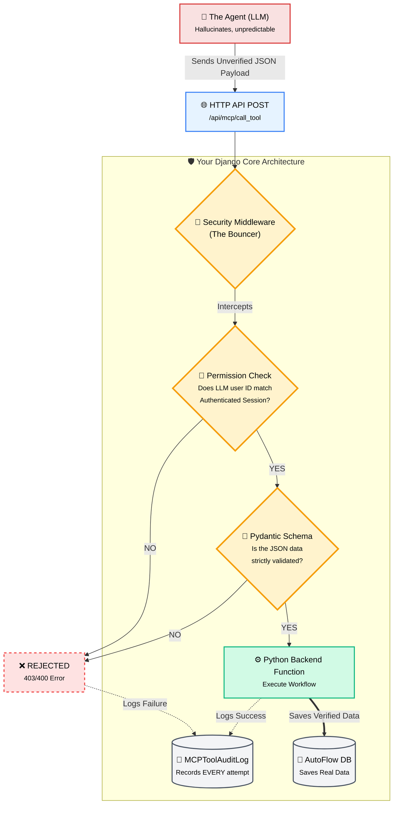

# MCP Security Architecture Presentation Guide

To brilliantly showcase this concept to your audience, you should walk them through the "Security Funnel" conceptually, and then back it up with **two physical visual proofs**: The Terminal Simulation (the script) and the Web Dashboard (Django Admin).

---

## 1. The Architecture Slide (The Concept)
You can use or screenshot the diagram below for your presentation. It visually details exactly how your "Bouncer" protects the backend.

---

## 2. The Interactive Web Showcase (Visual Proof)

The terminal script is great, but showing people an actual web dashboard proves this isn't just simulated math. Because I registered your tables into the Django Admin interface, you have a fully functioning Web Dashboard ready right now!

**During your showcase, do this:**
1. Open a terminal and run your server:
   `python manage.py runserver`
2. Open your web browser and go to:
   **`http://localhost:8000/admin`**
3. Log in with the credentials the showcase script just generated for you:
   - **Username**: `Admin_Alice`
   - **Password**: `password123`

When you log in, you will see a gorgeous dashboard. 
- Click into `Mcp tool audit logs`. You will see all the `BLOCKED`, `ERROR`, and `SUCCESS` red/green rows generated by your terminal tests! You can open them up and physically read the reasons the LLM was blocked (like *"Permission Scoping Violation"*).
- Showing the audience that every single LLM thought is intercepted, blocked if malicious, and instantly logged to a dashboard is the **absolute best way to prove you have achieved complete "Observability and Access Control".**
