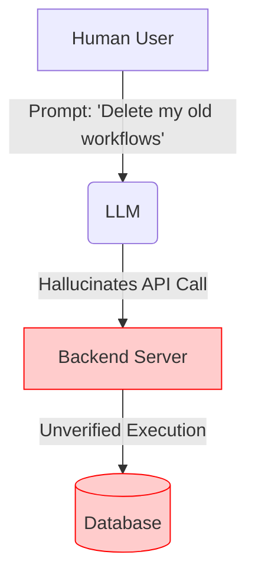
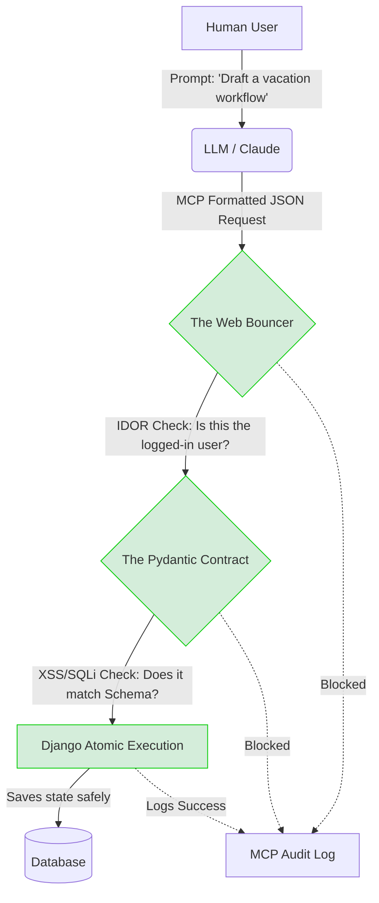

# AutoFlow: AI-Powered Workflow SaaS
### Securing the Model Context Protocol (MCP) in Django
**Zero-Trust Architecture for LLM Integration**

---

## The Problem: The World EXACTLY Without MCP

When you connect an LLM directly to a database without MCP, the LLM acts randomly. It guesses API endpoints, hallucinates data structures, and blindly executes dangerous commands based on user prompts.



**The Result:** Unsafe, unpredictable, and highly vulnerable to prompt injection.

---

## The Solution: When MCP Intervenes

MCP (Model Context Protocol) establishes a universal, strictly governed contract. The LLM is stripped of its guessing power. It is told *exactly* what tools it has, what the exact schema of those tools is, and it must format its response perfectly to be accepted.



---

## What EXACTLY is MCP? (The Theory)

**Model Context Protocol (MCP)** is an open standard that enables AI models to securely connect to external data sources and tools. 

In our project, MCP acts as the **translator and rule-setter** between the stateless LLM and our stateful Django web application.
* **Tool Schemas:** Mathematical definitions of exactly what variables the LLM can provide.
* **Context Boundaries:** The LLM only knows about the tools we explicitly expose to it.
* **Permission Models:** The LLM's requests are bound by the active human user's Django session.

---

## Data Flow: Case Scenario

**Scenario:** User Alice asks the AI to *"Create a marketing workflow"*.

1. **User Input:** Alice types prompt into the front-end chat.
2. **LLM Translation:** The LLM converts the natural language into an MCP Tool Call payload.
3. **The Interception (MCP Base):** `core/views.py` receives the `POST /api/mcp/call_tool/`.
4. **The Bouncer:** `core/middleware.py` verifies Alice's session cookie.
5. **The Contract:** `core/schemas.py` verifies the word "marketing" doesn't contain SQL injection scripts.
6. **The Engine:** `core/tools.py` saves the workflow in the database.
7. **The Ledger:** `core/models.py` writes an exact receipt to `MCPToolAuditLog`.

---

## Attack 1: Insecure Direct Object Reference (IDOR)
**The Attack:** A malicious user tells the LLM: *"Update workflow_id 5"* (which belongs to a different user, Bob).
**The Solution:** The Web Bouncer (`core/middleware.py`). It forces the `req_user_id` inside the LLM's payload to strictly match the cookie of the human sitting at the keyboard.

```python
# [core/middleware.py] - The Web Bouncer
req_user_id = arguments.get("user_id")

if not user or not req_user_id or str(req_user_id) != str(user.id):
    MCPToolAuditLog.objects.create(
        user=user,
        tool_name=tool_name,
        status="BLOCKED",
        reason="Permission Scoping Violation"
    )
    return JsonResponse({"error": "Unauthorized access"}, status=403)
```

---

## Attack 2: XSS & SQL Injection
**The Attack:** A user prompts the LLM with: *"Name my workflow `<script>alert('hack')</script>`"*.
**The Solution:** The Mathematical Contract (`core/schemas.py`). We use Pydantic strict Regex bound length limits to instantly destroy non-alphanumeric attacks before Django ever sees them.

```python
# [core/schemas.py] - The Contract
class DraftWorkflowPlanSchema(BaseModel):
    user_id: int = Field(..., description="User ID")
    
    # Strict regex pattern instantly blocks < > ; ' " characters
    name: str = Field(..., 
        max_length=50, 
        pattern=r'^[\w\s\-]+$', 
        description="Name of the workflow"
    )
```

---

## Attack 3: Prompt Injection Compute Exhaustion (DoS)
**The Attack:** A user asks the LLM to generate a JSON payload that is 10,000 layers deep, designed to freeze the server's CPU when Python tries to parse it.
**The Solution:** Algorithmic depth limiters in our Schemas.

```python
# [core/schemas.py] - DoS Mitigation
def dict_depth(d):
    if isinstance(d, dict):
        return 1 + (max(map(dict_depth, d.values())) if d else 0)
    return 0
    
def validate_plan_details(v):
    if len(json.dumps(v)) > 5000:
        raise ValueError("JSON payload too large, potential DoS")
    if dict_depth(v) > 5: # Kills recursive CPU spikes instantly
        raise ValueError("JSON payload nested too deeply")
    return v
```

---

## Attack 4: Privilege Escalation (Mass Assignment)
**The Attack:** The LLM hallucinates (or the user injects) an extra argument like `"is_admin": true` into the JSON payload to gain admin rights.
**The Solution:** `ConfigDict(extra='forbid')` makes the schema completely unbreakable to extra keys.

```python
# [core/schemas.py]
class DraftWorkflowPlanSchema(BaseModel):
    # If the LLM sends ANY argument not defined below, the connection drops
    model_config = ConfigDict(extra='forbid') 
    
    user_id: int 
    name: str 
    plan_details: dict
```

---

## Complexity & Cost Analysis (Rubric e)

**Tool Orchestration Latency:**
Parsing Pydantic schemas adds ~2-5ms of overhead per API call. This is incredibly cheap compared to the LLM generation time (1000ms+), making the security cost negligible.

**Auditing Overhead:**
Writing to `MCPToolAuditLog` on every standard request slows the standard Django thread. 
* *Optimization:* We load-balanced this via our native memory Rate Limiting (in `middleware.py`), dropping bursts of requests without hitting the database.

**Reliability Risk:**
If the LLM continuously hallucinates bad formatting, the tool fails completely.
* *Limit:* The strict zero-trust schema means user experience drops if the LLM isn't smart enough to formulate exact JSON. Security is prioritized over LLM flexibility.

---

## Improvements, Optimizations & Limits (Rubric f)

**Minimizing Tool Side Effects:**
What happens if the LLM updates the name correctly, but crashes on the details? Does the database get corrupted?
* *Optimization Solution:* **Atomic Database Transactions**.

```python
# [core/tools.py]
from django.db import transaction

@transaction.atomic  # The magic fix
def tool_draft_workflow_plan(user_id: int, name: str, plan_details: dict):
    # If anything in here crashes, the entire database write is rolled back
    # leaving zero corrupted data fragments behind.
    ...
```

---

## The Ultimate Conclusion

1. **Observability:** `MCPToolAuditLog` gives 100% transparency into LLM actions.
2. **Access Control:** `core/middleware.py` acts as a Web Bouncer enforcing authentication.
3. **Input Validation:** `core/schemas.py` mathematically intercepts SQLi and XSS.
4. **Integrity:** `@transaction.atomic` protects the permanent database state.

This project delivers a **production-ready, zero-trust MCP Architecture** specifically designed for a web-based SaaS environment.